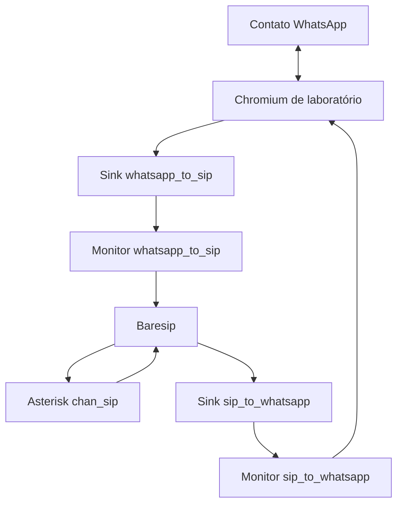

# Estudo de viabilidade do áudio

Estudo realizado em 9 de setembro de 2026 para Ubuntu 24.04, Baresip 1.0.0, Chromium/Puppeteer e Asterisk 13 com `chan_sip`.

Nenhuma instalação ou alteração de serviço faz parte desta etapa.

## Descoberta sobre o pacote do Ubuntu

O pacote `baresip-core` 1.0.0-4build14 do Ubuntu 24.04 inclui:

- `alsa.so`;
- `ctrl_tcp.so`;
- `g711.so`;
- `menu.so`;
- `opus.so`.

Ele **não inclui `pulse.so`**, embora esse módulo exista no código-fonte do Baresip 1.0.0. Portanto, a configuração inicialmente considerada com `audio_player pulse,...` e `audio_source pulse,...` não funciona apenas instalando os pacotes padrão.

Fontes:

- [lista oficial de arquivos do baresip-core no Ubuntu 24.04](https://packages.ubuntu.com/noble/amd64/baresip-core/filelist);
- [módulos do Baresip](https://github.com/baresip/baresip/wiki/Modules);
- [configuração do Baresip](https://github.com/baresip/baresip/wiki/Configuration).

## Arquitetura candidata revisada

A alternativa de menor complexidade é manter o módulo ALSA do Baresip e usar o plugin ALSA→PulseAudio fornecido por `libasound2-plugins`.

Esse pacote contém `libasound_module_pcm_pulse.so`. O Baresip pode então usar:

```text
audio_player alsa,pulse
audio_source alsa,pulse
```

As variáveis `PULSE_SINK` e `PULSE_SOURCE` selecionam os dispositivos padrão de cada processo. Elas têm precedência sobre a configuração padrão do cliente PulseAudio.

Fontes:

- [arquivos do libasound2-plugins no Ubuntu 24.04](https://packages.ubuntu.com/noble/amd64/libasound2-plugins/filelist);
- [pulse-client.conf do Ubuntu 24.04](https://manpages.ubuntu.com/manpages/noble/man5/pulse-client.conf.5.html).

## Roteamento proposto para uma sessão



Ambiente do Chromium:

```text
PULSE_SINK=lab_whatsapp_to_sip
PULSE_SOURCE=lab_sip_to_whatsapp.monitor
```

Ambiente do Baresip, invertido:

```text
PULSE_SINK=lab_sip_to_whatsapp
PULSE_SOURCE=lab_whatsapp_to_sip.monitor
```

O PulseAudio cria automaticamente uma fonte `.monitor` para cada `module-null-sink`. O módulo é documentado pelo [projeto PulseAudio](https://www.freedesktop.org/wiki/Software/PulseAudio/Documentation/User/Modules/).

## Execução do servidor de áudio

O PulseAudio em modo global não é a primeira escolha. A própria documentação do projeto registra desvantagens de segurança e isolamento no modo de sistema.

Para o laboratório, a opção preferida é:

- usuário de serviço exclusivo;
- uma instância PulseAudio pertencente a esse usuário;
- socket local não exposto na rede;
- dois sinks virtuais com nomes exclusivos;
- Chromium e Baresip executados sob o mesmo usuário de laboratório.

Fonte: [orientação oficial sobre PulseAudio em modo de sistema](https://www.freedesktop.org/wiki/Software/PulseAudio/Documentation/User/WhatIsWrongWithSystemWide/).

Isso não define ainda como os processos produtivos, atualmente executados pelo PM2, serão migrados. A produção só será desenhada depois do teste de concorrência.

## Permissão do microfone

O WPPConnect 2.3.0 já inicia o Chromium com `--autoplay-policy=no-user-gesture-required`, mas não concede explicitamente permissão de microfone no código revisado.

O laboratório deve testar a permissão com `BrowserContext.overridePermissions()` para `https://web.whatsapp.com`, concedendo apenas `microphone`. Permissões não listadas são negadas pelo Puppeteer, portanto isso deve ser aplicado a um contexto exclusivo de laboratório.

Fonte: [BrowserContext.overridePermissions no Puppeteer](https://pptr.dev/api/puppeteer.browsercontext.overridepermissions).

Não usar `--use-fake-device-for-media-stream` na ponte real. Esse parâmetro substitui o microfone por um dispositivo de teste. Ele pode ser útil apenas em um teste separado com WAV controlado.

Fonte: [switches de mídia do Chromium](https://chromium.googlesource.com/chromium/src/+/master/media/base/media_switches.cc).

## Controle do Baresip

O Baresip 1.0.0 contém `ctrl_tcp.so`. O módulo recebe comandos e publica eventos em JSON encapsulado por netstring.

Para o laboratório:

- escutar somente em `127.0.0.1`;
- usar uma porta exclusiva por instância;
- definir `call_max_calls 1`;
- carregar `alsa.so`, `g711.so` e `ctrl_tcp.so`;
- começar com `alaw`/`ulaw`, sem transcodificação desnecessária;
- não armazenar a senha SIP no repositório.

Fonte: [implementação oficial do ctrl_tcp](https://github.com/baresip/baresip/blob/v1.0.0/modules/ctrl_tcp/ctrl_tcp.c).

## Alternativas descartadas nesta etapa

| Alternativa | Situação | Motivo |
|---|---|---|
| Compilar `pulse.so` do Baresip | Reserva | Adiciona toolchain e manutenção de binário próprio |
| PulseAudio em modo global/root | Não recomendada | Piora isolamento e segurança |
| ALSA Loopback direto no Chromium | Não priorizada | Seleção de dispositivo WebRTC é menos previsível |
| PipeWire completo | Adiada | Amplia o escopo antes da prova básica |

## Testes obrigatórios antes do SIP

| ID | Objetivo | Critério de aprovação |
|---|---|---|
| AUDIO-00 | Inventariar binários, pacotes e módulos | Diagnóstico completo sem alteração |
| AUDIO-01 | Subir áudio do usuário de laboratório | `pactl info` responde pelo socket local |
| AUDIO-02 | Criar os dois sinks | sinks e monitores aparecem uma única vez |
| AUDIO-03 | Chromium reconhecer microfone | `enumerateDevices()` e permissão válidos |
| AUDIO-04 | Injetar WAV no WhatsApp | áudio recebido no telefone de teste |
| AUDIO-05 | Capturar áudio do WhatsApp | monitor registra áudio reproduzível |

Somente depois de `AUDIO-00` a `AUDIO-05` será criado o registro SIP de laboratório.

## Decisão provisória

Prosseguir com a prova de conceito usando:

```text
PulseAudio por usuário
  + dois module-null-sink
  + Baresip alsa,pulse
  + libasound2-plugins
  + ctrl_tcp limitado ao localhost
```

A decisão será revertida se `AUDIO-03`, `AUDIO-04` ou `AUDIO-05` falhar no Chromium real usado pelo WPPConnect.
