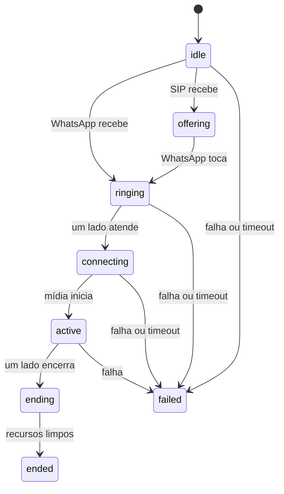

# Máquina de estados da chamada

`src/call-state-machine.js` concentra a sincronização entre WhatsApp, SIP e mídia sem conhecer WPPConnect, Baresip, PulseAudio ou HTTP.

Essa separação permite testar decisões e falhas antes de conectar adaptadores reais.

## Estados

## Fluxo WhatsApp → Asterisk

| Evento | Ação produzida |
|---|---|
| `whatsapp_incoming` | `dial_sip` |
| `sip_established` | `accept_whatsapp` |
| `whatsapp_active` | `start_media` |
| `media_started` | estado `active` |

O WhatsApp só é aceito depois de o lado SIP estar estabelecido.

## Fluxo Asterisk → WhatsApp

| Evento | Ação produzida |
|---|---|
| `sip_incoming` | `offer_whatsapp` |
| `whatsapp_ringing` | estado `ringing` |
| `whatsapp_active` | `accept_sip` |
| `sip_established` | `start_media` |
| `media_started` | estado `active` |

O SIP só é aceito depois de o WhatsApp atender.

## Encerramento

- WhatsApp encerrou: parar mídia e desligar SIP;
- SIP encerrou: parar mídia e encerrar WhatsApp;
- timeout: rejeitar ou encerrar somente os recursos presentes;
- comandos de limpeza são idempotentes e emitidos uma única vez;
- a sessão só chega a `ended` depois de WhatsApp, SIP e mídia estarem limpos.

## Limites atuais

- uma chamada por instância da máquina;
- sem IDs, telefones, ramais ou credenciais;
- sem temporizadores internos: o orquestrador futuro envia `timeout`;
- sem efeitos externos: a máquina apenas recebe eventos e devolve ações;
- ainda não conectada aos adaptadores WPPConnect e Baresip.

## Próximos testes

| ID | Teste | Situação |
|---|---|---|
| FLOW-01 | evento real WhatsApp → ação `dial_sip` simulada | Pendente |
| FLOW-02 | evento real Baresip → ação `accept_whatsapp` simulada | Pendente |
| FLOW-03 | desligamento WhatsApp → `hangup_sip` | Pendente |
| FLOW-04 | `CALL_CLOSED` → `end_whatsapp` | Pendente |
| FLOW-05 | timeout controlado sem recursos órfãos | Pendente |
